# C++游戏引擎—Capybara

## 构建

双击`GenerateProjects.bat`即可生成解决方案，自行编译并运行

- 如果启动时提示找不到assimp的相关依赖，我们提供了编译好的assimp库，位于`\Capybara\vendor\assimp\Debug`，将该文件夹中共4个文件拷贝到输出文件夹`\Capybara\bin\Debug-windows-x86_64\CapybaraEditor`即可

## 总体设计

项目基于OpenGL实现，使用到的外部库有assimp, GLAD, GLFW, glm, imgui, spdlog, stb

- 使用spdlog库来为我们的项目支持类似UE的**宏日志功能**，方便调试代码
- 使用访问者模式设计**事件系统**，根据对象的类型而对方法进行选择，即分派(Dispatch)
- **分层设计**。维护一个layerStack，在每一帧tick的时候转而tick每一个layer，可以自定义许多解耦的layer
- 采用逻辑与渲染分离的架构，维护了一个**渲染队列**，逻辑线程可以向渲染线程中添加lambda表达式，这是为了多线程考虑，但是目前还没有实现多线程。

- 目前的工作中心在**渲染**部分，我们维护了VertexBuffer, IndexBuffer, VertexArray, Texture, Shader等类来与OpenGL图形API交互，并供我们以一个较为精细的颗粒度组织与管理数据。
- 在表现层上基于**imgui**的示例文件改装了易于使用的GUI

- 在开发过程中还使用了NSight辅助**GPU调试**工作

### 代码说明

- 程序的入口在`EntryPoint`函数中，首先执行的是`InitializeCor`e, 这个函数的作用是初始化日志，以便我们在后续的代码中可以使用宏来打印输出。

- 紧接着是通过`CreateApplication`方法来生成application主体，注意：这个函数仅在引擎内核中声明，具体实现在客户端中，作为一个客户端实现的application，它是必须派生自内核中`Application`类。

- `Application`类：

  - 成员变量Window指针，指向当前打开的window，`Window`的作用主要是用来处理用户的输入，并通过事件系统来处理输入的逻辑。在Application的run循环中会先调用所有的layerstack中的layer的update函数，然后调用window的的update
  - 成员变量layerstack，用来将所有需要显示的layer入栈，方便app层中知道需要更新哪些layer，layerstack虽然名字叫stack，但其实这个类的底层并不是用栈来实现的，因为栈没有遍历的功能，其内部只是维护了一个简单的vector
  - 在Application的Init函数中要执行Renderer的Init函数
    - Renderer::Init函数是用来对准备渲染所需要的一些东西，初始化shaderLibrary和初始化RenderCommandQueue，初始化图形API（目前是OpenGL），并且执行**`SceneRenderer::Init`**，在SceneRenderer:Init中会简单初始化一些通用的数据，还有相机、天空盒、辐照度贴图还没有绑定

- 程序的执行逻辑是在每一帧都调用window和layer的update，而window的update只是获取io输入用，真正的渲染以及逻辑部分其实是在layer中，目前程序只有两个layer，一个是imguiLayer，用于前端gui的显示，一个是EditorLayer，负责编辑器的渲染工作与相关逻辑。

- `EditorLayer`类：

  - EditorLayer目前还是一个较为臃肿的类，其中也穿插了很多imgui的元素，换句话来说就是耦合性稍微有点大，但是主体的流程是相对清晰的

  - 我希望在editorlayer绑定到我的Application上时才调用它的生命周期函数OnAttach，在OnAttach函数里，完成了以下工作：

    - 加载hdr图，这里是从等距圆柱体投影->立方体投影->radiance mipmap -> 卷积irradiance
    - 初始化两个场景，ModelScene和SphereScene

  - Update函数：update相机和当前activeScene

    - Camera::OnUpdate: （后续将考虑不在update里面检测而是全都放在onEvent里）根据用户的输入可以执行三个操作：Pan平移，Rotate旋转，Zoom缩放，其中Pan和Zoom是用来改变FocalPoint和Distance的，Rotate是改变Yaw和Pitch，因为鼠标的输入是二维的，所以其实不可能能同时操作yaw roll pitch三个角度，实际上相机一般不会用到roll，（暂时）我们认为相机是始终\*正立\*的。在这之后根据focalpoint和distance计算出相机位置，根据pitch和yaw转换成四元数，最后根据四元数和position计算出view矩阵和rotation向量

    - Scene::update：遍历场景中的所有entity，每个entity都有绑定一个mesh（mesh是很多面的集合），对mesh执行update函数，主要作用是播放模型的动画；然后是调用SceneRenderer::BeginScene->SceneRenderer::SubmitEntity所有entity（存下来所有entity的mesh、material、transform到drawlist中）-> SceneRenderer::EndScene调用SceneRenderer::FlushDrawList，对drawlist中的所有数据执行两个pass，Geometrypass和Compositepass

      - GeometryPass：对每个mesh设置着色器中的viewProjection、CameraPosition、EnvRadianceTex、EnvIrradianceTex、BRDFLUTTexture，最后将其提交到渲染命令队列
      - CompositePass：主要是后处理用到，在执行着色器之前我们已经拥有了每个点的color，现在要对这些color首先乘上曝光率，然后利用一个公式计算出亮度（绿色对亮度的贡献最大，蓝色最小），根据色调映射算法将hdr的亮度映射位ldr亮度，根据这个新算出来的亮度与原来亮度的比值乘上color获得新的color，这还没完，还要经过gamma矫正，color的1/2.2次方才是最后绘制到屏幕上的像素的颜色

      > 关于Scene和SceneRenderer的关系：
      >
      > - SceneRenderer通过BeginScene函数的参数获得Scene指针，它不会修改Scene当中的数据，而是将Scene当中的我所需要的数据相机、天空盒、辐照度贴图存到一个静态局部变量s_Data中，至此，s_Data中包含了SceneRenderer所需要的所有数据
      > - 所以其实可以认为SceneRenderer是Scene的一个表现层，Scene负责数据的更新，而SceneRenderer负责把这些数据渲染到屏幕上

## 特性与实现

### 存储

由于工业元宇宙必然是要支持动画的并且对建模要求更高，我们选择了更现代的模型文件格式fbx。

借助了assimp库来实现功能，由于assimp已经为我们提供了fbx文件读取的基础操作，我们只需要将assimp导入的中间结果再转为我们项目需要的数据结构，具体见`Mesh::Mesh(const std::string& filename)`


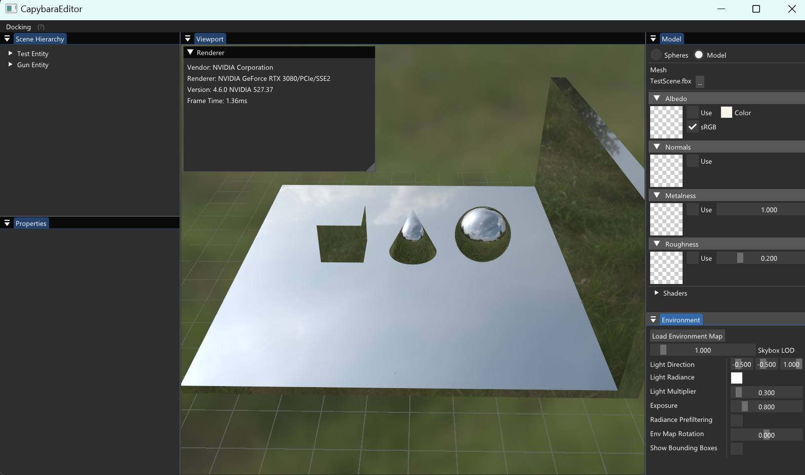

### 编辑

支持Albedo, Normals, Metalness, Roughness四个维度的材质的编辑

在shader中定义若干uniform变量

```glsl
uniform sampler2D u_AlbedoTexture;
uniform sampler2D u_NormalTexture;
uniform sampler2D u_MetalnessTexture;
uniform sampler2D u_RoughnessTexture;

uniform float u_AlbedoTexToggle;
uniform float u_NormalTexToggle;
uniform float u_MetalnessTexToggle;
uniform float u_RoughnessTexToggle;
```

并通过ImGui面板进行交互与控制

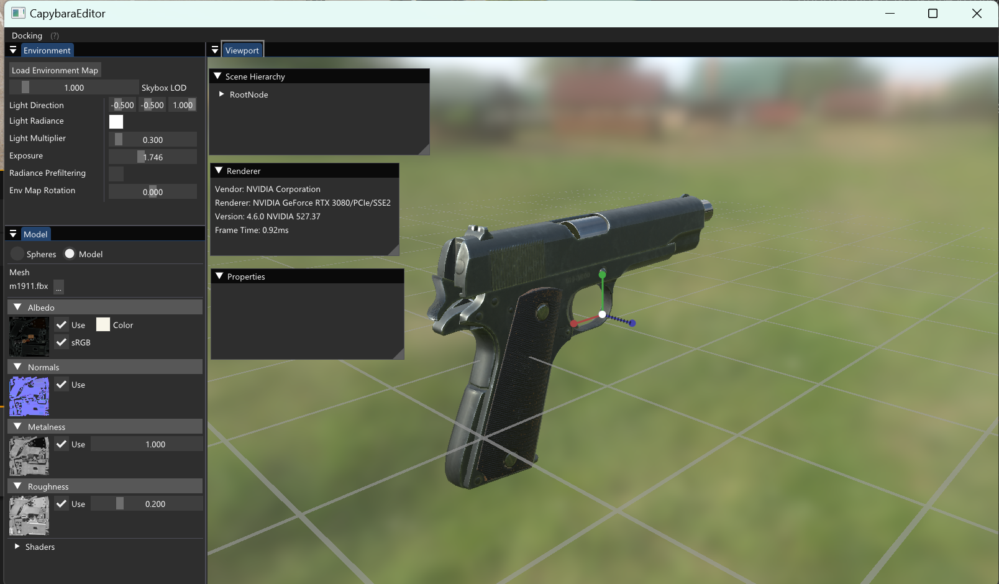

### 变换

按W控制Translation，E控制Rotation，R控制Scale，关于UI的显示与编辑引用了开源库[CedricGuillemet/ImGuizmo: Immediate mode 3D gizmo for scene editing and other controls based on Dear Imgui (github.com)](https://github.com/CedricGuillemet/ImGuizmo)里的实现

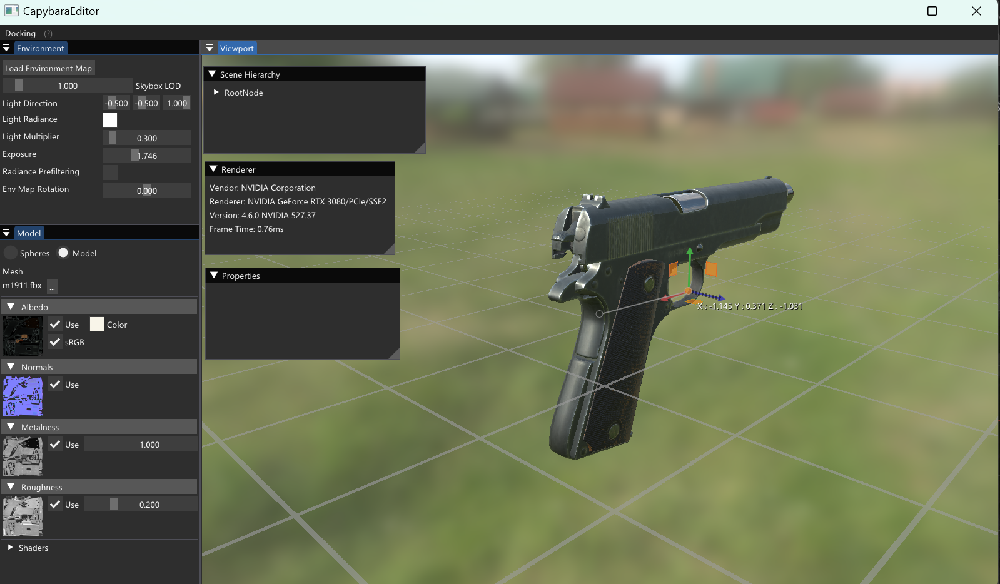

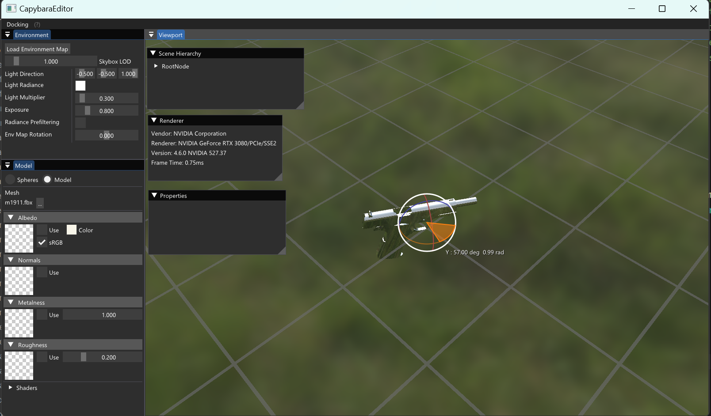

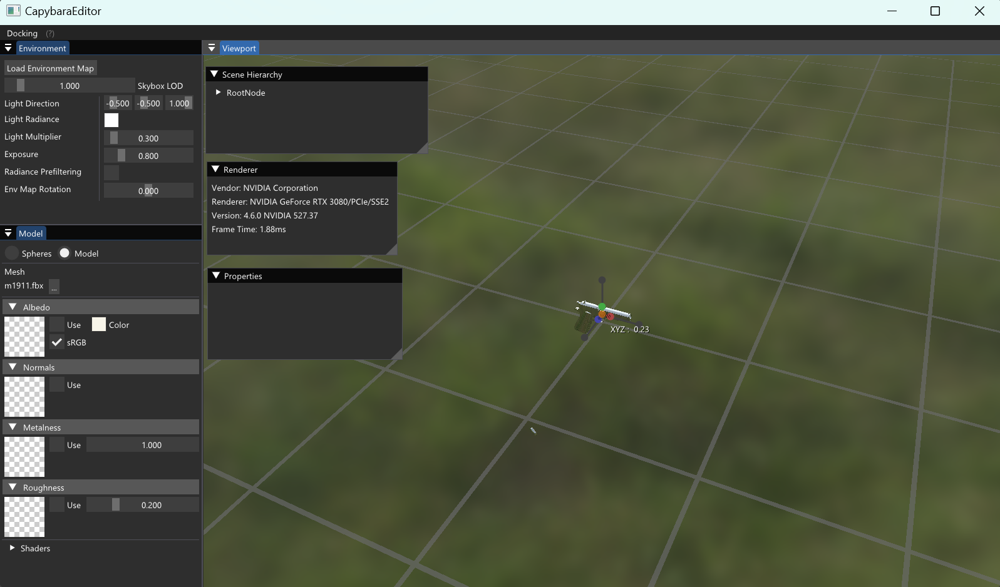

#### 关于Input与事件系统的设计说明

Application 初始化的时候会Create WindowsWindow，在WindowsWindow::Init函数中会调用glfw设置回调函数的api，事件的类型是由glfw的这些api可以接受的io类型决定的

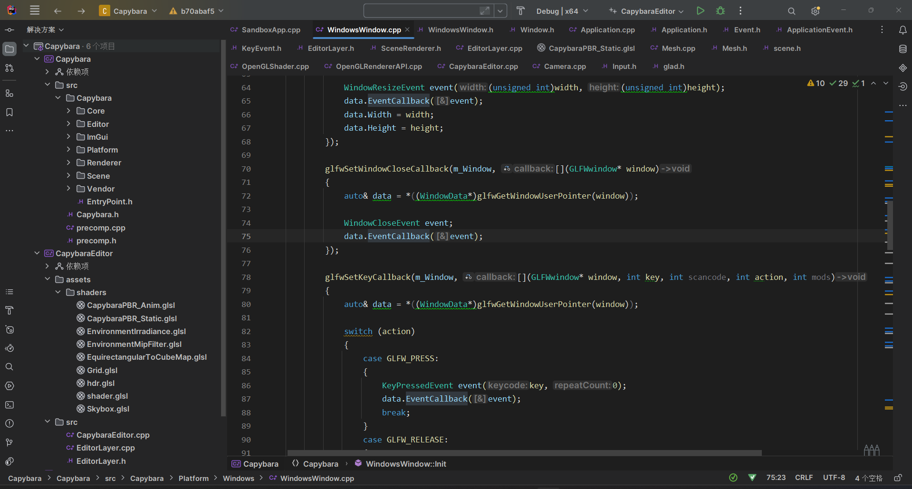

在这些回调函数中会将这些具体的事件（窗口 键盘 鼠标三大类）发给WindowData里的函数指针去具体执行我们自己的逻辑

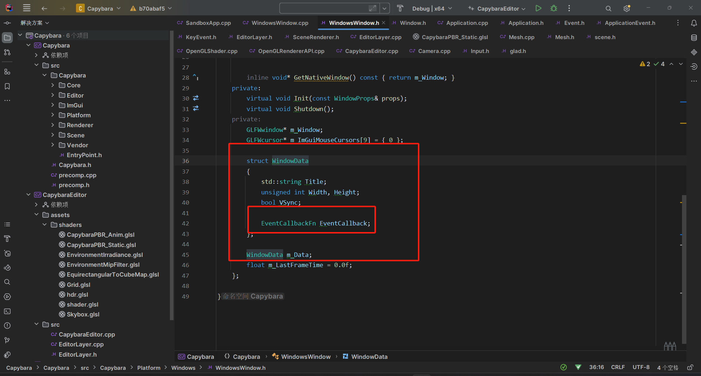

而这个函数指针的绑定在Application的构造函数中，他是紧随着上面的Create之后进行的

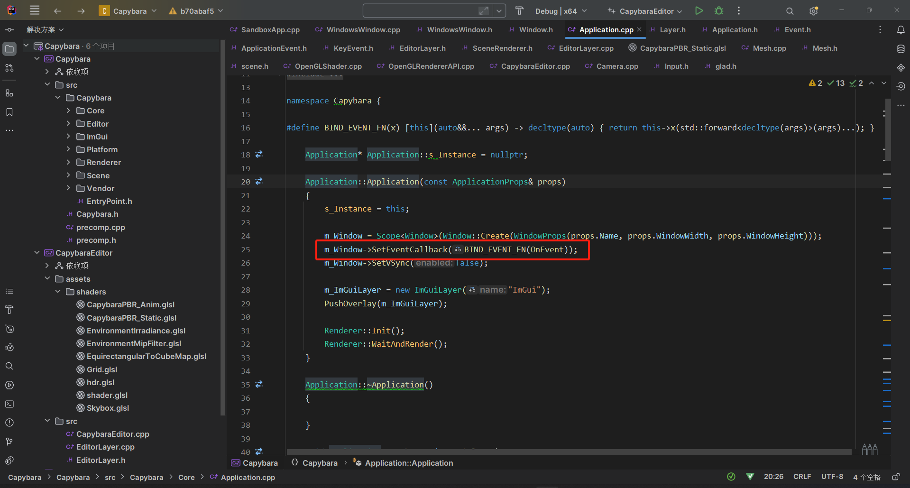

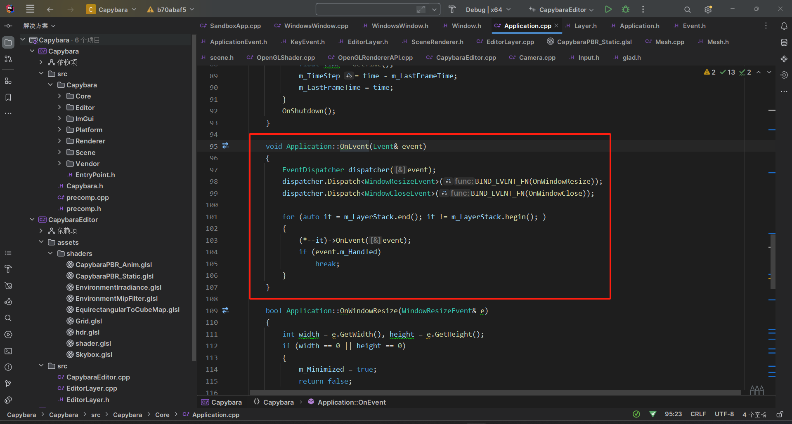

由于Application所直接管理的对象是Window和许多的Layer，所以在Application层面的OnEvent的做法是处理Window的event，而keyevent的逻辑留待具体负责业务的各种layer去实现，目前项目中只有EditorLayer和ImguiLayer，ImGuiLayer没有处理event，但是在EditorLayer中的OnEvent函数就处理了键盘按下这个动作

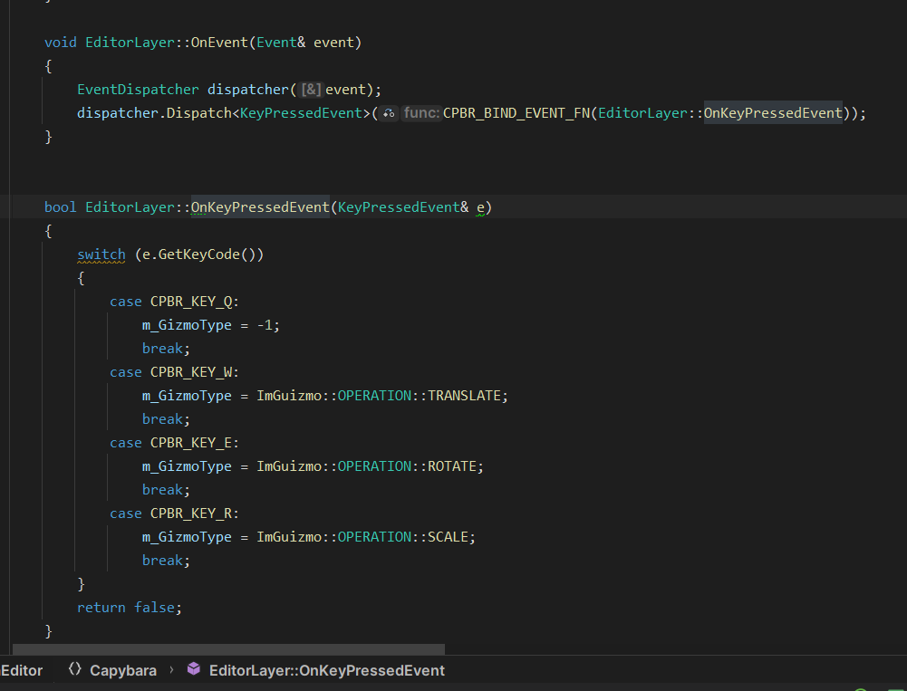

至于为什么有了这样一套event的机制之后还需要Input这样一套系统呢？

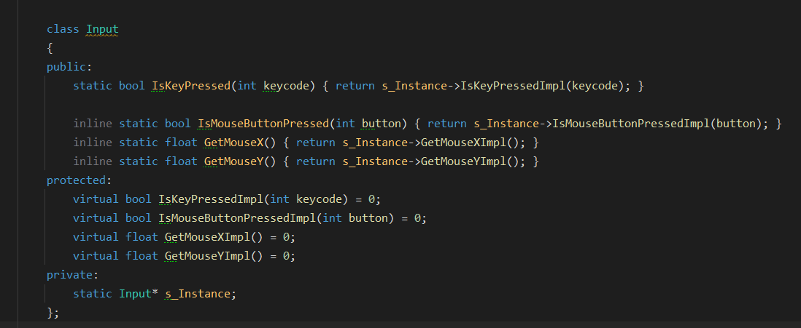

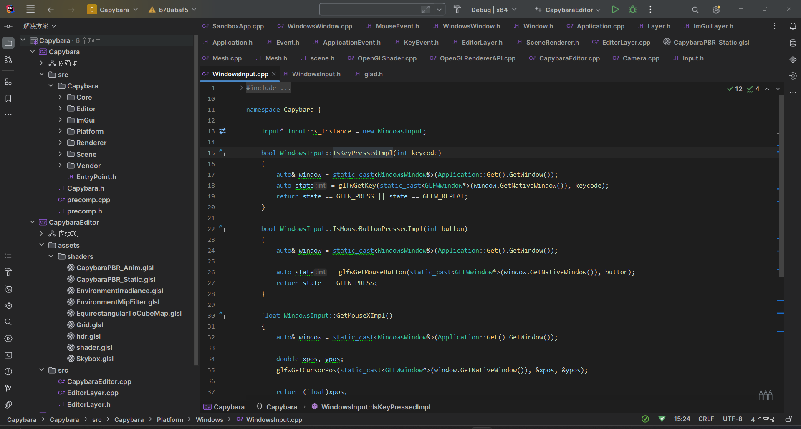

因为event是为了回调函数使用的，对event来说所接触到的最下层其实是Layer那个层次，而像所谓的Camera类是更具体的业务类，设计的时候并没有让event更加深入，是因为我觉得用户输入和回调函数其实不完全等价，我认为回调函数应该承载更为抽象的内容，所以Layer以下的类采用的是WindowsInput里的一套做法，这十分个性化，我也完全可以在EditorLayer::OnEvent中继续给Scene实现一个OnEvent成员函数并且调用它，然后继续套娃下去，但是这样设计的弊端在于如果是很底层的对象，想要处理一个io事件的话将会有很长的调用栈，如果业务复杂可能会导致阻塞，进而以后会有更多时序上的问题。而直接引入一个WindowsInput类可以更加灵活地处理这些IO事件

### 光照

使用cook-torrance光照模型，采用IBL。大概流程是：将hdr图从等距圆柱体投影转换为立方体投影，再获得radiance和irradiance，并复用RadianceMap作为天空盒，具体实现过程参考LearnOpenGL上的高级光照和PBR相关理论

着色器代码：

```glsl
//#type vertex
#version 430 core

layout(location = 0) in vec3 a_Position;
layout(location = 1) in vec3 a_Normal;
layout(location = 2) in vec3 a_Tangent;
layout(location = 3) in vec3 a_Binormal;
layout(location = 4) in vec2 a_TexCoord;

uniform mat4 u_ViewProjectionMatrix;
uniform mat4 u_Transform;

out VertexOutput
{
    vec3 WorldPosition;
    vec3 Normal;
    vec2 TexCoord;
    mat3 WorldNormals;
    mat3 WorldTransform;
    vec3 Binormal;
} vs_Output;

void main()
{
    vs_Output.WorldPosition = vec3(u_Transform * vec4(a_Position, 1.0));
    vs_Output.Normal = mat3(u_Transform) * a_Normal;
    vs_Output.TexCoord = vec2(a_TexCoord.x, 1.0 - a_TexCoord.y);
    vs_Output.WorldNormals = mat3(u_Transform) * mat3(a_Tangent, a_Binormal, a_Normal);
    vs_Output.WorldTransform = mat3(u_Transform);
    vs_Output.Binormal = a_Binormal;
    
    gl_Position = u_ViewProjectionMatrix * u_Transform * vec4(a_Position, 1.0);
}

//#type fragment
#version 430 core

const float PI = 3.141592;
const float Epsilon = 0.00001;

const int LightCount = 1;

// Constant normal incidence Fresnel factor for all dielectrics.
const vec3 Fdielectric = vec3(0.04);

struct Light {
    vec3 Direction;
    vec3 Radiance;
};

in VertexOutput
{
    vec3 WorldPosition;
    vec3 Normal;
    vec2 TexCoord;
    mat3 WorldNormals;
    mat3 WorldTransform;
    vec3 Binormal;
} vs_Input;

layout(location = 0) out vec4 color;

uniform Light lights;
uniform vec3 u_CameraPosition;

// PBR texture inputs
uniform sampler2D u_AlbedoTexture;
uniform sampler2D u_NormalTexture;
uniform sampler2D u_MetalnessTexture;
uniform sampler2D u_RoughnessTexture;

// Environment maps
uniform samplerCube u_EnvRadianceTex;
uniform samplerCube u_EnvIrradianceTex;

// BRDF LUT
uniform sampler2D u_BRDFLUTTexture;

uniform vec3 u_AlbedoColor;
uniform float u_Metalness;
uniform float u_Roughness;

uniform float u_EnvMapRotation;

// Toggles
uniform float u_RadiancePrefilter;
uniform float u_AlbedoTexToggle;
uniform float u_NormalTexToggle;
uniform float u_MetalnessTexToggle;
uniform float u_RoughnessTexToggle;

struct PBRParameters
{
    vec3 Albedo;
    float Roughness;
    float Metalness;
    
    vec3 Normal;
    vec3 View;
    float NdotV;
};

PBRParameters m_Params;

// GGX/Towbridge-Reitz normal distribution function.
// Uses Disney's reparametrization of alpha = roughness^2
float ndfGGX(float cosLh, float roughness)
{
    float alpha = roughness * roughness;
    float alphaSq = alpha * alpha;
    
    float denom = (cosLh * cosLh) * (alphaSq - 1.0) + 1.0;
    return alphaSq / (PI * denom * denom);
}

// Single term for separable Schlick-GGX below.
float gaSchlickG1(float cosTheta, float k)
{
    return cosTheta / (cosTheta * (1.0 - k) + k);
}

// Schlick-GGX approximation of geometric attenuation function using Smith's method.
float gaSchlickGGX(float cosLi, float NdotV, float roughness)
{
    float r = roughness + 1.0;
    float k = (r * r) / 8.0; // Epic suggests using this roughness remapping for analytic lights.
    return gaSchlickG1(cosLi, k) * gaSchlickG1(NdotV, k);
}

float GeometrySchlickGGX(float NdotV, float roughness)
{
    float r = (roughness + 1.0);
    float k = (r*r) / 8.0;
    
    float nom   = NdotV;
    float denom = NdotV * (1.0 - k) + k;
    
    return nom / denom;
}

float GeometrySmith(vec3 N, vec3 V, vec3 L, float roughness)
{
    float NdotV = max(dot(N, V), 0.0);
    float NdotL = max(dot(N, L), 0.0);
    float ggx2 = GeometrySchlickGGX(NdotV, roughness);
    float ggx1 = GeometrySchlickGGX(NdotL, roughness);
    
    return ggx1 * ggx2;
}

// Shlick's approximation of the Fresnel factor.
vec3 fresnelSchlick(vec3 F0, float cosTheta)
{
    return F0 + (1.0 - F0) * pow(1.0 - cosTheta, 5.0);
}

vec3 fresnelSchlickRoughness(vec3 F0, float cosTheta, float roughness)
{
    return F0 + (max(vec3(1.0 - roughness), F0) - F0) * pow(1.0 - cosTheta, 5.0);
}

// ---------------------------------------------------------------------------------------------------
// The following code (from Unreal Engine 4's paper) shows how to filter the environment map
// for different roughnesses. This is mean to be computed offline and stored in cube map mips,
// so turning this on online will cause poor performance
float RadicalInverse_VdC(uint bits)
{
    bits = (bits << 16u) | (bits >> 16u);
    bits = ((bits & 0x55555555u) << 1u) | ((bits & 0xAAAAAAAAu) >> 1u);
    bits = ((bits & 0x33333333u) << 2u) | ((bits & 0xCCCCCCCCu) >> 2u);
    bits = ((bits & 0x0F0F0F0Fu) << 4u) | ((bits & 0xF0F0F0F0u) >> 4u);
    bits = ((bits & 0x00FF00FFu) << 8u) | ((bits & 0xFF00FF00u) >> 8u);
    return float(bits) * 2.3283064365386963e-10; // / 0x100000000
}

vec2 Hammersley(uint i, uint N)
{
    return vec2(float(i)/float(N), RadicalInverse_VdC(i));
}

vec3 ImportanceSampleGGX(vec2 Xi, float Roughness, vec3 N)
{
    float a = Roughness * Roughness;
    float Phi = 2 * PI * Xi.x;
    float CosTheta = sqrt( (1 - Xi.y) / ( 1 + (a*a - 1) * Xi.y ) );
    float SinTheta = sqrt( 1 - CosTheta * CosTheta );
    vec3 H;
    H.x = SinTheta * cos( Phi );
    H.y = SinTheta * sin( Phi );
    H.z = CosTheta;
    vec3 UpVector = abs(N.z) < 0.999 ? vec3(0,0,1) : vec3(1,0,0);
    vec3 TangentX = normalize( cross( UpVector, N ) );
    vec3 TangentY = cross( N, TangentX );
    // Tangent to world space
    return TangentX * H.x + TangentY * H.y + N * H.z;
}

float TotalWeight = 0.0;

vec3 PrefilterEnvMap(float Roughness, vec3 R)
{
    vec3 N = R;
    vec3 V = R;
    vec3 PrefilteredColor = vec3(0.0);
    int NumSamples = 1024;
    for(int i = 0; i < NumSamples; i++)
    {
        vec2 Xi = Hammersley(i, NumSamples);
        vec3 H = ImportanceSampleGGX(Xi, Roughness, N);
        vec3 L = 2 * dot(V, H) * H - V;
        float NoL = clamp(dot(N, L), 0.0, 1.0);
        if (NoL > 0)
        {
            PrefilteredColor += texture(u_EnvRadianceTex, L).rgb * NoL;
            TotalWeight += NoL;
            }
    }
    return PrefilteredColor / TotalWeight;
}

// ---------------------------------------------------------------------------------------------------

vec3 RotateVectorAboutY(float angle, vec3 vec)
{
    angle = radians(angle);
    mat3x3 rotationMatrix ={vec3(cos(angle),0.0,sin(angle)),
    vec3(0.0,1.0,0.0),
    vec3(-sin(angle),0.0,cos(angle))};
    return rotationMatrix * vec;
}

vec3 Lighting(vec3 F0)
{
    vec3 result = vec3(0.0);
    for(int i = 0; i < LightCount; i++)
    {
        vec3 Li = -lights.Direction;
        vec3 Lradiance = lights.Radiance;
        vec3 Lh = normalize(Li + m_Params.View);
        
        // Calculate angles between surface normal and various light vectors.
        float cosLi = max(0.0, dot(m_Params.Normal, Li));
        float cosLh = max(0.0, dot(m_Params.Normal, Lh));
        
        vec3 F = fresnelSchlick(F0, max(0.0, dot(Lh, m_Params.View)));
//        vec3 F = fresnelSchlickRoughness(F0, max(0.0, dot(Lh, m_Params.View)), m_Params.Roughness);
        float D = ndfGGX(cosLh, m_Params.Roughness);
        float G = gaSchlickGGX(cosLi, m_Params.NdotV, m_Params.Roughness);
        
        vec3 kd = (1.0 - F) * (1.0 - m_Params.Metalness);
        vec3 diffuseBRDF = kd * m_Params.Albedo;
        
        // Cook-Torrance
        vec3 specularBRDF = (F * D * G) / max(Epsilon, 4.0 * cosLi * m_Params.NdotV);
        
        result += (diffuseBRDF + specularBRDF) * Lradiance * cosLi;
    }
    return result;
}

vec3 IBL(vec3 F0, vec3 Lr)
{
    // diffuse
    vec3 irradiance = texture(u_EnvIrradianceTex, m_Params.Normal).rgb;
    vec3 F = fresnelSchlick(F0, m_Params.NdotV);
    vec3 kd = (1.0 - F) * (1.0 - m_Params.Metalness);
    vec3 diffuseIBL = m_Params.Albedo * irradiance;
    // specular
    int u_EnvRadianceTexLevels = textureQueryLevels(u_EnvRadianceTex);
    float NoV = clamp(m_Params.NdotV, 0.0, 1.0);
    vec3 R = 2.0 * dot(m_Params.View, m_Params.Normal) * m_Params.Normal - m_Params.View;
    vec3 specularIrradiance = textureLod(u_EnvRadianceTex, RotateVectorAboutY(u_EnvMapRotation, Lr), (m_Params.Roughness * m_Params.Roughness) * u_EnvRadianceTexLevels).rgb;
    
    // Sample BRDF Lut, 1.0 - roughness for y-coord because texture was generated (in Sparky) for gloss model
    vec2 specularBRDF = texture(u_BRDFLUTTexture, vec2(m_Params.NdotV, 1.0 - m_Params.Roughness)).rg;
    vec3 specularIBL = specularIrradiance * (F * specularBRDF.x + specularBRDF.y);
    
    return kd * diffuseIBL + specularIBL;
}

void main()
{
// Standard PBR inputs
    m_Params.Albedo = u_AlbedoTexToggle > 0.5 ? texture(u_AlbedoTexture, vs_Input.TexCoord).rgb : u_AlbedoColor;
    m_Params.Metalness = u_MetalnessTexToggle > 0.5 ? texture(u_MetalnessTexture, vs_Input.TexCoord).r : u_Metalness;
    m_Params.Roughness = u_RoughnessTexToggle > 0.5 ?  texture(u_RoughnessTexture, vs_Input.TexCoord).r : u_Roughness;
    m_Params.Roughness = max(m_Params.Roughness, 0.05); // Minimum roughness of 0.05 to keep specular highlight
    
    // Normals (either from vertex or map)
    m_Params.Normal = normalize(vs_Input.Normal);
    if (u_NormalTexToggle > 0.5)
    {
        m_Params.Normal = normalize(2.0 * texture(u_NormalTexture, vs_Input.TexCoord).rgb - 1.0);
        m_Params.Normal = normalize(vs_Input.WorldNormals * m_Params.Normal);
    }
    
    m_Params.View = normalize(u_CameraPosition - vs_Input.WorldPosition);
    m_Params.NdotV = max(dot(m_Params.Normal, m_Params.View), 0.0);
    
    // Specular reflection vector
    vec3 Lr = 2.0 * m_Params.NdotV * m_Params.Normal - m_Params.View;
    
    // Fresnel reflectance, metals use albedo
    vec3 F0 = mix(Fdielectric, m_Params.Albedo, m_Params.Metalness);
    
    vec3 lightContribution = Lighting(F0);
    vec3 iblContribution = IBL(F0, Lr);
    
    color = vec4(lightContribution + iblContribution, 1.0);
}
```

### 漫游

支持相机在场景中漫游，按住左alt之后可以：鼠标左键控制**视角方向**，鼠标中键控制**相机位置**，鼠标右键控制**相机缩放**。实现原理是相机主要维护四个量focal point、distance和yaw，pitch，主要代码如下：

```cpp
void Camera::MousePan(const glm::vec2& delta)
{
    auto [xSpeed, ySpeed] = PanSpeed();
    m_FocalPoint += -GetRightDirection() * delta.x * xSpeed * m_Distance;
    m_FocalPoint += GetUpDirection() * delta.y * ySpeed * m_Distance;
}

void Camera::MouseRotate(const glm::vec2& delta)
{
    float yawSign = GetUpDirection().y < 0 ? -1.0f : 1.0f;
    m_Yaw += yawSign * delta.x * RotationSpeed();
    m_Pitch += delta.y * RotationSpeed();
}

void Camera::MouseZoom(float delta)
{
    m_Distance -= delta * ZoomSpeed();
    if (m_Distance < 1.0f)
    {
        m_FocalPoint += GetForwardDirection();
        m_Distance = 1.0f;
    }
}
```

### 记录

支持动态物体的连续多帧绘制，我们利用fbx文件来实现这个功能，事实上动画也只不过是fbx文件内的已有的数据而已，只要完成了fbx文件的导入，这项工作几乎是水到渠成，但由于多了骨骼数据，着色器代码需要更新：

```glsl
//#type vertex
#version 430 core

layout(location = 0) in vec3 a_Position;
layout(location = 1) in vec3 a_Normal;
layout(location = 2) in vec3 a_Tangent;
layout(location = 3) in vec3 a_Binormal;
layout(location = 4) in vec2 a_TexCoord;

layout(location = 5) in ivec4 a_BoneIndices;
layout(location = 6) in vec4 a_BoneWeights;

uniform mat4 u_ViewProjectionMatrix;
uniform mat4 u_Transform;

const int MAX_BONES = 100;
uniform mat4 u_BoneTransforms[100];

out VertexOutput
{
	vec3 WorldPosition;
    vec3 Normal;
	vec2 TexCoord;
	mat3 WorldNormals;
	vec3 Binormal;
} vs_Output;

void main()
{
    mat4 boneTransform = u_BoneTransforms[a_BoneIndices[0]] * a_BoneWeights[0];
    boneTransform += u_BoneTransforms[a_BoneIndices[1]] * a_BoneWeights[1];
    boneTransform += u_BoneTransforms[a_BoneIndices[2]] * a_BoneWeights[2];
    boneTransform += u_BoneTransforms[a_BoneIndices[3]] * a_BoneWeights[3];

	vec4 localPosition = boneTransform * vec4(a_Position, 1.0);

	vs_Output.WorldPosition = vec3(u_Transform * boneTransform * vec4(a_Position, 1.0));
    vs_Output.Normal = mat3(boneTransform) * a_Normal;
	vs_Output.TexCoord = vec2(a_TexCoord.x, 1.0 - a_TexCoord.y);
	vs_Output.WorldNormals = mat3(u_Transform) * mat3(a_Tangent, a_Binormal, a_Normal);
	vs_Output.Binormal = mat3(boneTransform) * a_Binormal;

	gl_Position = u_ViewProjectionMatrix * u_Transform * localPosition;
}

//#type fragment
#version 430 core

const float PI = 3.141592;
const float Epsilon = 0.00001;

const int LightCount = 1;

// Constant normal incidence Fresnel factor for all dielectrics.
const vec3 Fdielectric = vec3(0.04);

struct Light {
	vec3 Direction;
	vec3 Radiance;
};

in VertexOutput
{
	vec3 WorldPosition;
    vec3 Normal;
	vec2 TexCoord;
	mat3 WorldNormals;
	vec3 Binormal;
} vs_Input;

layout(location=0) out vec4 color;

uniform Light lights;
uniform vec3 u_CameraPosition;

// PBR texture inputs
uniform sampler2D u_AlbedoTexture;
uniform sampler2D u_NormalTexture;
uniform sampler2D u_MetalnessTexture;
uniform sampler2D u_RoughnessTexture;

// Environment maps
uniform samplerCube u_EnvRadianceTex;
uniform samplerCube u_EnvIrradianceTex;

// BRDF LUT
uniform sampler2D u_BRDFLUTTexture;

uniform vec3 u_AlbedoColor;
uniform float u_Metalness;
uniform float u_Roughness;

uniform float u_EnvMapRotation;

// Toggles
uniform float u_RadiancePrefilter;
uniform float u_AlbedoTexToggle;
uniform float u_NormalTexToggle;
uniform float u_MetalnessTexToggle;
uniform float u_RoughnessTexToggle;

struct PBRParameters
{
	vec3 Albedo;
	float Roughness;
	float Metalness;

	vec3 Normal;
	vec3 View;
	float NdotV;
};

PBRParameters m_Params;

// GGX/Towbridge-Reitz normal distribution function.
// Uses Disney's reparametrization of alpha = roughness^2
float ndfGGX(float cosLh, float roughness)
{
	float alpha = roughness * roughness;
	float alphaSq = alpha * alpha;

	float denom = (cosLh * cosLh) * (alphaSq - 1.0) + 1.0;
	return alphaSq / (PI * denom * denom);
}

// Single term for separable Schlick-GGX below.
float gaSchlickG1(float cosTheta, float k)
{
	return cosTheta / (cosTheta * (1.0 - k) + k);
}

// Schlick-GGX approximation of geometric attenuation function using Smith's method.
float gaSchlickGGX(float cosLi, float NdotV, float roughness)
{
	float r = roughness + 1.0;
	float k = (r * r) / 8.0; // Epic suggests using this roughness remapping for analytic lights.
	return gaSchlickG1(cosLi, k) * gaSchlickG1(NdotV, k);
}

float GeometrySchlickGGX(float NdotV, float roughness)
{
    float r = (roughness + 1.0);
    float k = (r*r) / 8.0;

    float nom   = NdotV;
    float denom = NdotV * (1.0 - k) + k;

    return nom / denom;
}

float GeometrySmith(vec3 N, vec3 V, vec3 L, float roughness)
{
    float NdotV = max(dot(N, V), 0.0);
    float NdotL = max(dot(N, L), 0.0);
    float ggx2 = GeometrySchlickGGX(NdotV, roughness);
    float ggx1 = GeometrySchlickGGX(NdotL, roughness);

    return ggx1 * ggx2;
}

// Shlick's approximation of the Fresnel factor.
vec3 fresnelSchlick(vec3 F0, float cosTheta)
{
	return F0 + (1.0 - F0) * pow(1.0 - cosTheta, 5.0);
}

vec3 fresnelSchlickRoughness(vec3 F0, float cosTheta, float roughness)
{
    return F0 + (max(vec3(1.0 - roughness), F0) - F0) * pow(1.0 - cosTheta, 5.0);
} 

// ---------------------------------------------------------------------------------------------------
// The following code (from Unreal Engine 4's paper) shows how to filter the environment map
// for different roughnesses. This is mean to be computed offline and stored in cube map mips,
// so turning this on online will cause poor performance
float RadicalInverse_VdC(uint bits) 
{
    bits = (bits << 16u) | (bits >> 16u);
    bits = ((bits & 0x55555555u) << 1u) | ((bits & 0xAAAAAAAAu) >> 1u);
    bits = ((bits & 0x33333333u) << 2u) | ((bits & 0xCCCCCCCCu) >> 2u);
    bits = ((bits & 0x0F0F0F0Fu) << 4u) | ((bits & 0xF0F0F0F0u) >> 4u);
    bits = ((bits & 0x00FF00FFu) << 8u) | ((bits & 0xFF00FF00u) >> 8u);
    return float(bits) * 2.3283064365386963e-10; // / 0x100000000
}

vec2 Hammersley(uint i, uint N)
{
    return vec2(float(i)/float(N), RadicalInverse_VdC(i));
}

vec3 ImportanceSampleGGX(vec2 Xi, float Roughness, vec3 N)
{
	float a = Roughness * Roughness;
	float Phi = 2 * PI * Xi.x;
	float CosTheta = sqrt( (1 - Xi.y) / ( 1 + (a*a - 1) * Xi.y ) );
	float SinTheta = sqrt( 1 - CosTheta * CosTheta );
	vec3 H;
	H.x = SinTheta * cos( Phi );
	H.y = SinTheta * sin( Phi );
	H.z = CosTheta;
	vec3 UpVector = abs(N.z) < 0.999 ? vec3(0,0,1) : vec3(1,0,0);
	vec3 TangentX = normalize( cross( UpVector, N ) );
	vec3 TangentY = cross( N, TangentX );
	// Tangent to world space
	return TangentX * H.x + TangentY * H.y + N * H.z;
}

float TotalWeight = 0.0;

vec3 PrefilterEnvMap(float Roughness, vec3 R)
{
	vec3 N = R;
	vec3 V = R;
	vec3 PrefilteredColor = vec3(0.0);
	int NumSamples = 1024;
	for(int i = 0; i < NumSamples; i++)
	{
		vec2 Xi = Hammersley(i, NumSamples);
		vec3 H = ImportanceSampleGGX(Xi, Roughness, N);
		vec3 L = 2 * dot(V, H) * H - V;
		float NoL = clamp(dot(N, L), 0.0, 1.0);
		if (NoL > 0)
		{
			PrefilteredColor += texture(u_EnvRadianceTex, L).rgb * NoL;
			TotalWeight += NoL;
		}
	}
	return PrefilteredColor / TotalWeight;
}

// ---------------------------------------------------------------------------------------------------

vec3 RotateVectorAboutY(float angle, vec3 vec)
{
    angle = radians(angle);
    mat3x3 rotationMatrix ={vec3(cos(angle),0.0,sin(angle)),
                            vec3(0.0,1.0,0.0),
                            vec3(-sin(angle),0.0,cos(angle))};
    return rotationMatrix * vec;
}

vec3 Lighting(vec3 F0)
{
	vec3 result = vec3(0.0);
	for(int i = 0; i < LightCount; i++)
	{
		vec3 Li = -lights.Direction;
		vec3 Lradiance = lights.Radiance;
		vec3 Lh = normalize(Li + m_Params.View);

		// Calculate angles between surface normal and various light vectors.
		float cosLi = max(0.0, dot(m_Params.Normal, Li));
		float cosLh = max(0.0, dot(m_Params.Normal, Lh));

		vec3 F = fresnelSchlick(F0, max(0.0, dot(Lh, m_Params.View)));
		float D = ndfGGX(cosLh, m_Params.Roughness);
		float G = gaSchlickGGX(cosLi, m_Params.NdotV, m_Params.Roughness);

		vec3 kd = (1.0 - F) * (1.0 - m_Params.Metalness);
		vec3 diffuseBRDF = kd * m_Params.Albedo;

		// Cook-Torrance
		vec3 specularBRDF = (F * D * G) / max(Epsilon, 4.0 * cosLi * m_Params.NdotV);

		result += (diffuseBRDF + specularBRDF) * Lradiance * cosLi;
	}
	return result;
}

vec3 IBL(vec3 F0, vec3 Lr)
{
	vec3 irradiance = texture(u_EnvIrradianceTex, m_Params.Normal).rgb;
	vec3 F = fresnelSchlickRoughness(F0, m_Params.NdotV, m_Params.Roughness);
	vec3 kd = (1.0 - F) * (1.0 - m_Params.Metalness);
	vec3 diffuseIBL = m_Params.Albedo * irradiance;

	int u_EnvRadianceTexLevels = textureQueryLevels(u_EnvRadianceTex);
	float NoV = clamp(m_Params.NdotV, 0.0, 1.0);
	vec3 R = 2.0 * dot(m_Params.View, m_Params.Normal) * m_Params.Normal - m_Params.View;
	vec3 specularIrradiance = textureLod(u_EnvRadianceTex, RotateVectorAboutY(u_EnvMapRotation, Lr), (m_Params.Roughness * m_Params.Roughness) * u_EnvRadianceTexLevels).rgb;

	// Sample BRDF Lut, 1.0 - roughness for y-coord because texture was generated (in Sparky) for gloss model
	vec2 specularBRDF = texture(u_BRDFLUTTexture, vec2(m_Params.NdotV, 1.0 - m_Params.Roughness)).rg;
	vec3 specularIBL = specularIrradiance * (F * specularBRDF.x + specularBRDF.y);

	return kd * diffuseIBL + specularIBL;
}

void main()
{
	// Standard PBR inputs
	m_Params.Albedo = u_AlbedoTexToggle > 0.5 ? texture(u_AlbedoTexture, vs_Input.TexCoord).rgb : u_AlbedoColor; 
	m_Params.Metalness = u_MetalnessTexToggle > 0.5 ? texture(u_MetalnessTexture, vs_Input.TexCoord).r : u_Metalness;
	m_Params.Roughness = u_RoughnessTexToggle > 0.5 ?  texture(u_RoughnessTexture, vs_Input.TexCoord).r : u_Roughness;
    m_Params.Roughness = max(m_Params.Roughness, 0.05); // Minimum roughness of 0.05 to keep specular highlight

	// Normals (either from vertex or map)
	m_Params.Normal = normalize(vs_Input.Normal);
	if (u_NormalTexToggle > 0.5)
	{
		m_Params.Normal = normalize(2.0 * texture(u_NormalTexture, vs_Input.TexCoord).rgb - 1.0);
		m_Params.Normal = normalize(vs_Input.WorldNormals * m_Params.Normal);
	}

	m_Params.View = normalize(u_CameraPosition - vs_Input.WorldPosition);
	m_Params.NdotV = max(dot(m_Params.Normal, m_Params.View), 0.0);
		
	// Specular reflection vector
	vec3 Lr = 2.0 * m_Params.NdotV * m_Params.Normal - m_Params.View;

	// Fresnel reflectance, metals use albedo
	vec3 F0 = mix(Fdielectric, m_Params.Albedo, m_Params.Metalness);

	vec3 lightContribution = vec3(0.0);//Lighting(F0);
	vec3 iblContribution = IBL(F0, Lr);

	color = vec4(lightContribution + iblContribution, 1.0);
}
```